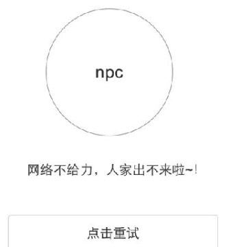

# EmbedView
嵌入式View框架

## 前言

**一朝被蛇咬十年怕井绳。**刚开始实习接触到的第一个项目，因为是企业内部项目，所以在用户体验方面设计的并不严谨，就比如：所有的列表页面在数据为空时没有做任何处理，就是空着摆在那里。那么实际上我们应该根据现实为空的原因给用户以提示。

类似这样：

OK,我提出来了，添加任务也自然交给了我。**噩梦来了！**

基本上所有有ListView的页面都需要做添加改动，这个数量是按照几十个来算的。（由于界面路径较深且对项目熟悉程度不高，可能到现在都有个别页面没有找到被漏掉了）

公共控件！！该死的公共控件！！这是我的实习生涯的第一堂课！

之后又接触到了Toolbar这个控件，同样的事情有没有？你需要在每个layout文件里去添加这个Toolbar控件！不行！这个问题必须解决，否则我会疯掉的！！！

## 解决方案

OK，背景介绍废话有点多了。下面介绍正文：

解决思路：有没有一种办法，可以提前就把这些公共控件都包装进去呢？所有程序猿都不会容忍做重复的事情的！

想一下，我们的的布局文件是如何添加进Activity的？

		//重载方法，resId or View 都可以
        setContentView(R.layout.activity_main);
        
那既然View也可以，我们是不是可以在setContentView之前，在我们的布局文件外层，再包裹一下，把我们想加的文件嵌入进去？

想到就做！ 

**包装结构图**

	RootView(FrameLayout){
		ToolBar
		ContentView(LinearLayout){
			TopWidge
			UserView   （layoutResId）
			BottomWidget
		}
		coverWidgets(ArrayMap<Integer, View>)[
			0:Loading(gone)
			1:TipView(match,match,gone)
			2:customView
			...
		]
	}

这里我包装进了这么几个控件：

- ToolBar
- TopWidge(顶部控件，通常用来显示网络异常等提示信息，QQ的无网络提示)
- UserView（我们的实际布局文件）
- BottomWidget(底部控件，通常用来显示权限提示信息，或类似抽屉的结构)
- coverWidgets（覆盖全屏的控件）
	- Loading
	- TipView(类似前言里的图片，做空数据提示，无网络提示，建议将他们集合进一个控件里)
	- 自定义控件…
	

那这个结构图列出来以后实现就很简单。具体详见项目代码，截下来我们将用法。

## 用法

框架很简单，只提供两个类

- EmbedView.java

	结构图中的RootView，管理所有的嵌入式控件，并控制其显示

- EmbedManager.java

	负责创建创建EmbedView
	
	

### 单纯的View包装类

EmbedManager就是一个对View装箱的过程，塞进去一个View，get出来一个EmbedView，就想这个样子：

		EmbedManager embedManager = new EmbedManager.Builder(this, layoutResID)
                .addTopWidget(LayoutInflater.from(this).inflate(R.layout.widget_top_view, null))
                .addBottomWidget(LayoutInflater.from(this).inflate(R.layout.widget_bottom_view, null))
                .addCenterTipView(new NoDataTips(this))
                .addLoadView(LayoutInflater.from(this).inflate(R.layout.widget_loading_view, null))
                .build();
        EmbedView embedView = embedManager.getEmbedView();
        
        

但实际上这样的应用场景并不常见，因为EmbedManager包装都是公共控件。

### 在BaseActivity中包装

因为我们的初衷是避免重复的添加公共控件，所以在父类中直接添加是最佳的选择。

但需要注意的是，继承是一种侵入式的方式，某些不需要这些控件Activity可能就会被强加这些控件，造成不必要的浪费。那么我们可以这样做。

**BaseActivity** 是你原本的activity父类，不需要的包装控件的，依然继承这个

**BaseViewActivity extends BaseActivity**  需要的包装控件的Acitivty继承该Activity

	public class BaseViewActivity extends AppCompatActivity {

    	private EmbedManager embedManager;

    	/**
    	 * 子类可以通过rootView获取提前包装好的公共控件
    	 */
    	protected EmbedView rootView;
    	private Toolbar toolbar;

    	@Override
    	public void setContentView(int layoutResID) {

        	initEmbedView(layoutResID);

        	toolbar = rootView.getToolbar();
        	//将包装好的View赋值给ContentView
        	setContentView(rootView);
        	/*把 toolbar 设置到Activity 中*/
        	setSupportActionBar(toolbar);
        	/*自定义的一些操作*/
        	onCreateCustomToolBar(toolbar);
    	}

    	private void initEmbedView(int layoutResID) {
        	embedManager = new EmbedManager.Builder(this, layoutResID)
                	.addToolbar(R.layout.widget_toolbar, R.id.id_tool_bar)
                	.addTopWidget(LayoutInflater.from(this).inflate(R.layout.widget_top_view, null))
                	.addBottomWidget(LayoutInflater.from(this).inflate(R.layout.widget_bottom_view, null))
                	.addCenterTipView(new NoDataTips(this))
                	.addLoadView(LayoutInflater.from(this).inflate(R.layout.widget_loading_view, null))
                	.build();
        	rootView = embedManager.getEmbedView();
    	}

    	public void onCreateCustomToolBar(Toolbar toolbar) {
        	toolbar.setContentInsetsRelative(0, 0);
    	}

    	public void setTitle(String title) {
        	if (getSupportActionBar() != null) {
            	getSupportActionBar().setTitle(title);
        	}
    	}

    	/**
    	 * 同样父类也可以提前写好show and hide方法，直接供子类调用
    	 */
    	public void showNoDataTipView(){
        	rootView.showCenterTipView();
    	}
    
    	public void hideNoDataTipView(){
        	rootView.showCenterTipView();
    	}
	}

**特殊情况：**有的Activity需要包装控件1，2，3.有的只要1，2.难道要写两个甚至更多的BaseViewActivity 吗？**不！**

你可以在 setContentView方法之前，向父类传递参数，告知父类需要哪些控件，父类在setContentView里根据参数动态添加。

## 引用

	dependencies {
    	compile 'com.github.zhaoxuan:embed-view:0.2'
	}

